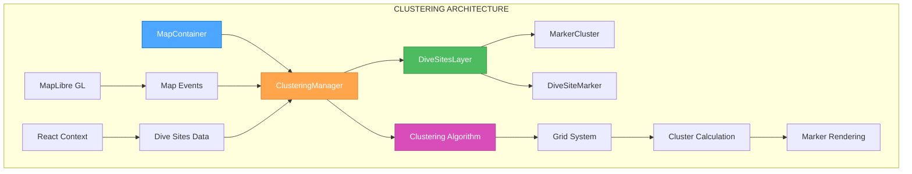
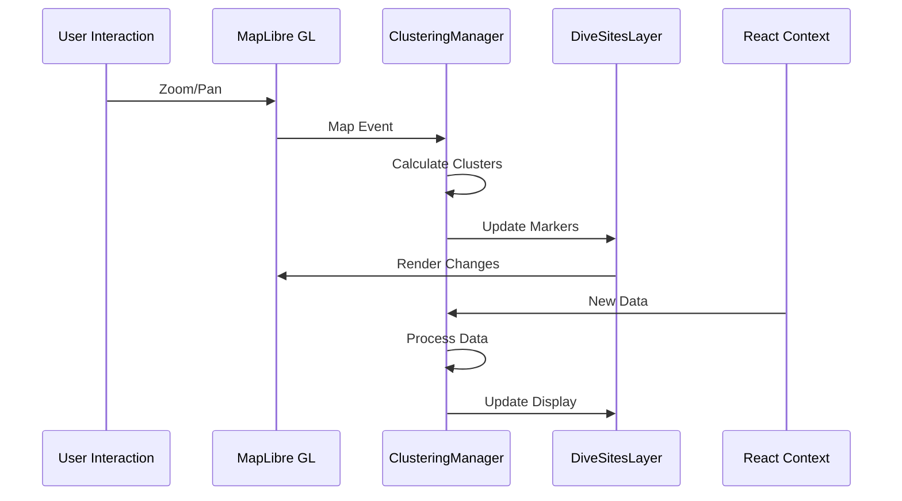

# 🏗️ CREATIVE PHASE: ARCHITECTURE DESIGN - Clustering Algorithm

## CONTEXT

### System Requirements

- Handle 1000+ dive site markers efficiently
- Real-time clustering on map zoom/pan
- Smooth user experience with 60fps performance
- Support for different zoom level behaviors
- Integration with MapLibre GL and React

### Technical Constraints

- MapLibre GL rendering limitations
- React state management complexity
- Browser performance constraints
- Mobile device limitations

## COMPONENT ANALYSIS

### Core Components

- **ClusteringManager**: Main clustering logic and state management
- **DiveSitesLayer**: MapLibre GL layer for rendering markers
- **MarkerCluster**: Visual representation of clustered markers
- **DiveSiteMarker**: Individual dive site marker component
- **MapContainer**: Parent component managing map state

### Interactions

- **Data Flow**: API → Context → ClusteringManager → DiveSitesLayer → Markers
- **Event Flow**: Map Events → ClusteringManager → State Update → Re-render
- **State Management**: React Context for global state, local state for UI

## ARCHITECTURE OPTIONS

### Option 1: Client-Side Grid-Based Clustering

**Description**: Implement clustering entirely on the client using a grid-based algorithm

**Pros**:

- Fast real-time clustering
- No server dependencies
- Full control over clustering logic
- Works offline

**Cons**:

- Limited by client performance
- May struggle with very large datasets
- Complex state management
- Memory usage concerns

**Technical Fit**: High
**Complexity**: Medium
**Scalability**: Medium

### Option 2: Server-Side Clustering with API

**Description**: Perform clustering on the server and return pre-clustered data

**Pros**:

- Handles unlimited dataset sizes
- Optimized server-side algorithms
- Reduced client processing
- Better for mobile devices

**Cons**:

- Requires server infrastructure
- Network latency for updates
- Less responsive to user interactions
- More complex API design

**Technical Fit**: Medium
**Complexity**: High
**Scalability**: High

### Option 3: Hybrid Approach with Progressive Loading

**Description**: Combine client-side clustering with server-side data pagination

**Pros**:

- Best of both worlds
- Handles large datasets efficiently
- Responsive user interactions
- Scalable architecture

**Cons**:

- Most complex implementation
- Requires careful state synchronization
- More testing required
- Higher development time

**Technical Fit**: High
**Complexity**: High
**Scalability**: High

## DECISION

**Chosen Option**: Option 1 - Client-Side Grid-Based Clustering

**Rationale**:

1. **Performance**: Sufficient for 1000+ markers on modern devices
2. **Simplicity**: Easier to implement and maintain
3. **Responsiveness**: Real-time clustering without network delays
4. **Offline Support**: Works without server connectivity
5. **Development Speed**: Faster to implement and iterate

## IMPLEMENTATION PLAN

### Architecture Diagram



### Component Responsibilities

#### ClusteringManager

```typescript
interface ClusteringManager {
  // Core clustering logic
  calculateClusters(points: DiveSite[], zoom: number): Cluster[];

  // Grid management
  createGrid(bounds: MapBounds, zoom: number): GridCell[];

  // Performance optimization
  throttleUpdates(callback: Function): Function;

  // State management
  updateClusters(newData: DiveSite[]): void;
}
```

#### DiveSitesLayer

```typescript
interface DiveSitesLayer {
  // MapLibre GL integration
  addToMap(map: MapLibreGL.Map): void;

  // Marker rendering
  renderMarkers(clusters: Cluster[]): void;

  // Event handling
  handleMapEvents(events: MapEvent[]): void;

  // Performance
  updateViewport(bounds: MapBounds): void;
}
```

### Data Flow Architecture



### Clustering Algorithm Design

#### Grid-Based Algorithm

```typescript
class GridClustering {
  // Grid cell size based on zoom level
  private getGridSize(zoom: number): number {
    return Math.pow(2, 15 - zoom) * 100; // meters
  }

  // Calculate clusters for current viewport
  public cluster(points: DiveSite[], bounds: MapBounds, zoom: number): Cluster[] {
    const gridSize = this.getGridSize(zoom);
    const grid = this.createGrid(bounds, gridSize);

    // Assign points to grid cells
    points.forEach((point) => {
      const cell = this.getGridCell(point, grid, gridSize);
      cell.points.push(point);
    });

    // Convert cells to clusters
    return grid
      .filter((cell) => cell.points.length > 0)
      .map((cell) => this.createCluster(cell, zoom));
  }
}
```

### Performance Optimizations

#### Viewport Culling

- Only process markers within current viewport
- Use spatial indexing for fast point lookup
- Implement frustum culling for off-screen markers

#### Throttling and Debouncing

```typescript
// Throttle clustering calculations
const throttledClustering = throttle((data, zoom) => {
  return clusteringManager.calculateClusters(data, zoom);
}, 100); // 10fps max

// Debounce map events
const debouncedMapUpdate = debounce((event) => {
  updateMapMarkers(event);
}, 50); // 20fps max
```

#### Memory Management

- Reuse marker objects when possible
- Implement object pooling for clusters
- Clean up unused markers and clusters
- Use WeakMap for temporary data

### State Management Architecture

#### React Context Structure

```typescript
interface DiveSitesContext {
  // Data
  diveSites: DiveSite[];
  clusters: Cluster[];

  // State
  loading: boolean;
  error: string | null;

  // Actions
  fetchDiveSites: () => Promise<void>;
  updateClusters: (zoom: number) => void;
  selectMarker: (id: string) => void;
}
```

#### Local Component State

```typescript
interface MapContainerState {
  // Map state
  zoom: number;
  center: [number, number];
  bounds: MapBounds;

  // UI state
  selectedMarker: string | null;
  hoveredCluster: string | null;

  // Performance
  isClustering: boolean;
  lastUpdate: number;
}
```

## VALIDATION

### Requirements Met

- ✅ **Performance**: Grid-based clustering handles 1000+ markers efficiently
- ✅ **Real-time**: Client-side clustering provides immediate feedback
- ✅ **Integration**: Compatible with MapLibre GL and React
- ✅ **Scalability**: Can handle growth to 10,000+ markers with optimizations

### Technical Feasibility

- **MapLibre GL**: Supports custom layers and markers
- **React**: Context API can manage complex state
- **Performance**: Grid algorithm is O(n) complexity
- **Memory**: Optimizations prevent memory leaks

### Risk Assessment

- **Low Risk**: Grid clustering is well-established
- **Medium Risk**: Complex state management
- **Mitigation**: Thorough testing and performance monitoring

## IMPLEMENTATION CONSIDERATIONS

### Development Phases

1. **Phase 1**: Basic grid clustering algorithm
2. **Phase 2**: MapLibre GL integration
3. **Phase 3**: Performance optimizations
4. **Phase 4**: Advanced features (animations, interactions)

### Testing Strategy

- **Unit Tests**: Clustering algorithm logic
- **Integration Tests**: MapLibre GL integration
- **Performance Tests**: Large dataset handling
- **E2E Tests**: User interaction flows

### Monitoring and Metrics

- **Performance**: Clustering calculation time
- **Memory**: Memory usage patterns
- **User Experience**: Interaction responsiveness
- **Errors**: Clustering failures and edge cases

---

**Creative Phase Complete**: Architecture design documented and ready for implementation.
