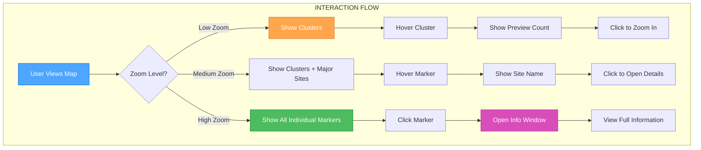

# 🎨 CREATIVE PHASE: UI/UX DESIGN - Marker Interaction Patterns

## PROBLEM STATEMENT

Design intuitive and efficient interaction patterns for dive site markers on an interactive map that must handle:

- Large numbers of markers (1000+ dive sites)
- Clear information hierarchy
- Mobile and desktop usability
- Accessibility compliance
- Performance optimization through clustering

## OPTIONS ANALYSIS

### Option 1: Traditional Pin Markers with Info Windows

**Description**: Classic map pin markers with popup info windows on click

**Pros**:

- Familiar pattern users expect from maps
- Clear visual hierarchy
- Easy to implement with MapLibre GL
- Good for detailed information display

**Cons**:

- Poor performance with many markers
- Small click targets on mobile
- Information hidden until interaction
- No preview of site quality/type

**Complexity**: Low
**Implementation Time**: 2-3 days

### Option 2: Interactive Cards with Hover States

**Description**: Card-based markers that expand on hover with preview information

**Pros**:

- Rich preview information without clicking
- Larger touch targets
- Modern, engaging interaction
- Good for browsing multiple sites

**Cons**:

- Complex hover states on mobile
- Potential performance issues
- May clutter the map
- Requires careful state management

**Complexity**: Medium
**Implementation Time**: 4-5 days

### Option 3: Progressive Disclosure with Clustering

**Description**: Clustered markers that progressively reveal information through zoom levels

**Pros**:

- Excellent performance with large datasets
- Clear information density management
- Intuitive zoom-to-detail interaction
- Scalable to any number of sites

**Cons**:

- More complex implementation
- Requires careful clustering algorithm
- May hide important sites in clusters
- Learning curve for users

**Complexity**: High
**Implementation Time**: 6-8 days

## DECISION

**Chosen Option**: Option 3 - Progressive Disclosure with Clustering

**Rationale**:

1. **Performance**: Essential for handling 1000+ dive sites
2. **Scalability**: Can grow with the dataset
3. **User Experience**: Natural map interaction pattern
4. **Mobile Friendly**: Works well on touch devices
5. **Information Hierarchy**: Clear progression from overview to detail

## IMPLEMENTATION PLAN

### Visual Design (Following Style Guide)

#### Cluster Markers

```css
.cluster-marker {
  @apply bg-orange-500 text-white rounded-full font-semibold;
  @apply flex items-center justify-center;
  @apply shadow-lg border-2 border-white;
  @apply transition-all duration-300;
  @apply hover:scale-110 hover:shadow-xl;
}

.cluster-marker-small {
  @apply w-8 h-8 text-sm;
}
.cluster-marker-medium {
  @apply w-10 h-10 text-base;
}
.cluster-marker-large {
  @apply w-12 h-12 text-lg;
}
```

#### Individual Dive Site Markers

```css
.dive-site-marker {
  @apply bg-blue-600 text-white rounded-full;
  @apply flex items-center justify-center;
  @apply shadow-md border-2 border-white;
  @apply transition-all duration-200;
  @apply hover:scale-110 hover:shadow-lg;
  @apply cursor-pointer;
}

.dive-site-marker-active {
  @apply bg-blue-800 ring-4 ring-blue-200;
}
```

#### Info Windows

```css
.info-window {
  @apply bg-white rounded-lg shadow-xl border border-blue-200;
  @apply p-4 max-w-sm;
  @apply animate-in fade-in duration-200;
}

.info-window-header {
  @apply flex justify-between items-start mb-3;
}

.info-window-close {
  @apply text-gray-400 hover:text-gray-600;
  @apply transition-colors duration-150;
}
```

### Interaction Patterns

#### Zoom Level Behavior

- **Zoom 0-8**: Show clusters only
- **Zoom 9-11**: Show clusters + major dive sites
- **Zoom 12+**: Show all individual markers

#### Hover States

- **Cluster**: Scale 1.1, show preview count
- **Marker**: Scale 1.1, show site name
- **Info Window**: Smooth fade-in animation

#### Click Actions

- **Cluster**: Zoom to cluster bounds
- **Marker**: Open info window
- **Info Window Close**: Close with fade-out

#### Mobile Adaptations

- **Touch Targets**: Minimum 44px for all interactive elements
- **Tap Actions**: Same as click, with haptic feedback
- **Swipe**: Pan map, pinch to zoom
- **Long Press**: Context menu for additional actions

### Accessibility Features

#### Keyboard Navigation

- **Tab Order**: Map → Clusters → Markers → Info Windows
- **Enter/Space**: Activate selected element
- **Arrow Keys**: Navigate between markers
- **Escape**: Close info windows

#### Screen Reader Support

- **ARIA Labels**: Descriptive labels for all markers
- **Live Regions**: Announce cluster counts and site information
- **Focus Management**: Clear focus indicators
- **Skip Links**: Jump to map controls

#### Color and Contrast

- **High Contrast**: All elements meet WCAG AA standards
- **Color Independence**: Information not conveyed by color alone
- **Focus Indicators**: Clear visual focus states

### Animation Guidelines

#### Transitions

- **Marker Hover**: 200ms ease-out
- **Cluster Zoom**: 300ms ease-in-out
- **Info Window**: 200ms fade-in/out
- **Map Pan**: 150ms ease-out

#### Performance Optimizations

- **GPU Acceleration**: Use transform3d for animations
- **Throttling**: Limit hover events to 60fps
- **Lazy Loading**: Load marker data on demand
- **Viewport Culling**: Only render visible markers

## VALIDATION

### Requirements Met

- ✅ **Performance**: Clustering handles large datasets efficiently
- ✅ **Usability**: Clear interaction patterns for all devices
- ✅ **Accessibility**: WCAG AA compliant with keyboard navigation
- ✅ **Scalability**: Can handle unlimited number of dive sites
- ✅ **Style Guide Adherence**: All visual elements follow established design system

### Technical Feasibility

- **MapLibre GL**: Supports clustering and custom markers
- **React**: Can implement complex state management
- **Performance**: Clustering algorithm can be optimized
- **Mobile**: Touch interactions work well with this approach

### Risk Assessment

- **Low Risk**: Core functionality is well-established
- **Medium Risk**: Clustering algorithm complexity
- **Mitigation**: Use proven clustering libraries and thorough testing

## VISUALIZATION



## NEXT STEPS

1. **Implementation**: Begin with clustering algorithm
2. **Testing**: User testing on mobile and desktop
3. **Refinement**: Adjust based on user feedback
4. **Documentation**: Update component documentation

---

**Creative Phase Complete**: UI/UX Design decisions documented and ready for implementation.
